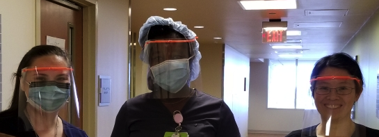

3D Printed Face Shields
=======================

This site provides information on how to 3D print Face Shields.
The goal is to use the simplest design that will work is relatively fast and easy to build.

Please share your own experiences and suggestions for improvement. 

This is an Open Source project (shared under [Apache License, v2](LICENSE.txt)), so use what 
you find here as you see fit, but please do take the time to improve this site by creating 
[Issues](https://github.com/bha-github-organization/trip-d-print/issues) or better yet: [Pull Requests](https://github.com/bha-github-organization/trip-d-print/pulls). 

---------
I’ve been working with local nurses who are helping people at Capital Health (Pennington, NJ) and at the Mercer County Covid-19
Testing center. They’ve been using 3D printed face shields that are very simple to print and assemble.
I’m asking for anyone nearby with a 3D printer who would like to volunteer to please help in this effort 
by printing the face shield frame, and maybe even assembling the transparency too. 

Here's how the Face Shields look in action:

We tried a number of different designs, and this one was the best balance of functionality and ease of production.

I’m using the [US Three Hole Punch](stl/Visor_Frame_NORTH_AMERICA_LETTER_v2.stl) version (mostly because I own a 3 hole punch).

Original design files are from here: https://www.youmagine.com/designs/protective-visor-by-3dverkstan

To let you know what to expect, the frame takes about 1 hour, 34 minutes to print on my 
[Prusa](https://www.prusa3d.com) MK3 printer.
Whatever filament you have handy is fine. I've been using PETG.

The transparency is a sheet (purchased from Staples): 
[Apollo Write-On Transparency Film](https://www.staples.com/Apollo-Write-On-Transparency-Film-Clear-8-1-2-W-x-11-H-100-Box/product_829333)
WO100C-B
8.5 x 11 in
Write-On Transparency Film
100 sheets

Please share other sources if you know of any.

Learnings
---------

* Mike S is taking this up a notch: He is moving the local High School's printers to the
First Aid squad, where the EMTs will start churning out these face shields. Mike also had a great comment: 
"Have you tried 'nesting' the frames so you can get more than one frame per print?". Doh! Well no, I hadn't.
If anyone can create a nested .stl file, please share it here (if you beat Mike to it)! See: [Issue #1](https://github.com/bha-github-organization/trip-d-print/issues/1)

* Kasia Q mentioned using UV to sterilize the frames, so they could be reusable!

* To help monitor print job progress, I setup [Octoprint](https://octoprint.org) on a [Raspberryp Pi 4](https://www.raspberrypi.org)
 using [these steps](https://community.octoprint.org/t/setting-up-octoprint-on-a-raspberry-pi-running-raspbian/2337).
